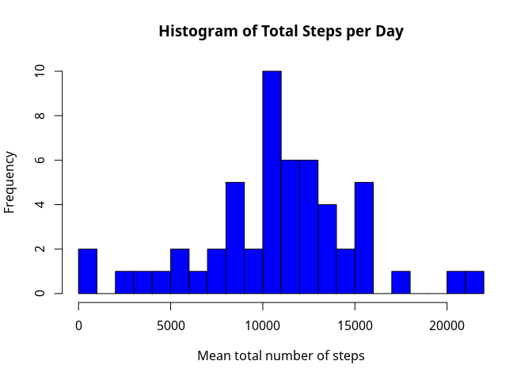
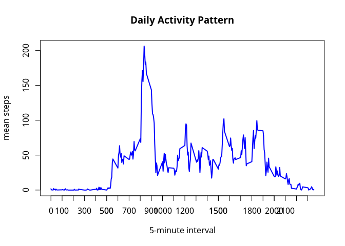
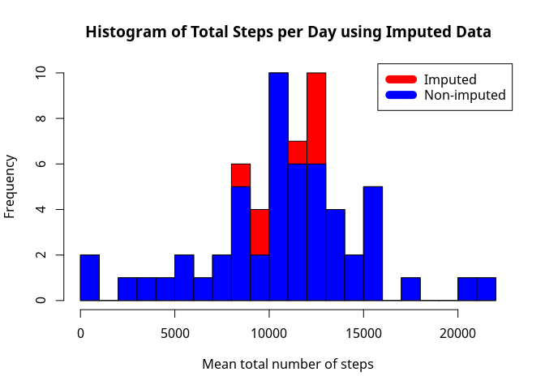
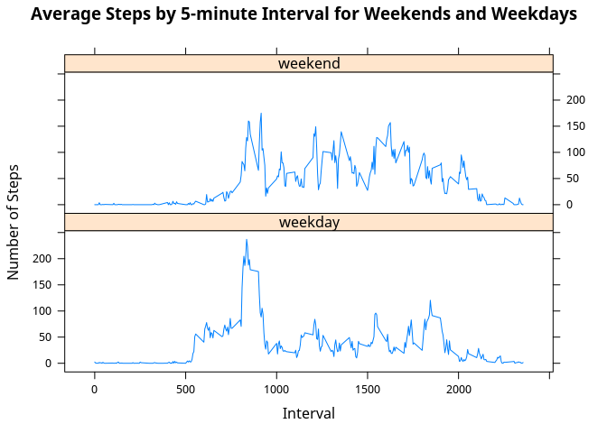

# Reproducible Research: Peer Assessment 1

## Requirements
#### data analysis:

```r
require("dplyr")
```

```
## Loading required package: dplyr
```

```
## 
## Attaching package: 'dplyr'
```

```
## The following objects are masked from 'package:stats':
## 
##     filter, lag
```

```
## The following objects are masked from 'package:base':
## 
##     intersect, setdiff, setequal, union
```
#### plots:

```r
require("ggplot2")
```

```
## Loading required package: ggplot2
```

```r
require("lattice")
```

```
## Loading required package: lattice
```
## Loading and preprocessing the data

```r
activity <- read.csv("activity.csv")
```

## What is mean total number of activityByDayNAsteps taken per day?

### Make a histogram of the total number of steps taken each day

```r
activityByDays <- activity %>% 
                   group_by(date) %>% 
                   summarise(stepsSum = sum(steps))

hist(activityByDays$stepsSum, 
     breaks = 30, 
     xlab="Mean total number of steps", 
     main = "Histogram of Total Steps per Day",
     col="blue")
```



### Mean of the total number of steps taken per day:

```r
mean(activityByDays$stepsSum, na.rm = TRUE)
```

```
## [1] 10766.19
```

### Median of the total number of steps taken per day:

```r
median(activityByDays$stepsSum, na.rm = TRUE)
```

```
## [1] 10765
```

### Clean environment

```r
rm(activityByDays)
```

## What is the average daily activity pattern?


```r
activityByinterval <- activity %>% 
                       group_by(interval) %>% 
                       summarise(stepsMean = mean(steps, na.rm =TRUE))

plot(activityByinterval$interval, 
     activityByinterval$stepsMean, 
     type="l", 
     lwd=2, 
     xlab = "5-minute interval", 
     ylab = "mean steps", 
     main = "Daily Activity Pattern", 
     col="blue")
axis(1, at = seq(100, 2300, by = 100))
```



### Which 5-minute interval, on average across all the days in the dataset, contains the maximum number of steps?

```r
maxStepsInterval <- which.max(activityByinterval$stepsMean)
activityByinterval[maxStepsInterval,]
```

```
## Source: local data frame [1 x 2]
## 
##   interval stepsMean
##      (int)     (dbl)
## 1      835  206.1698
```

### Clean environment

```r
rm(activityByinterval, maxStepsInterval)
```


## Imputing missing values

### Total number of missing values in the dataset

```r
sum(is.na(activity$steps))
```

```
## [1] 2304
```

### Filling in all of the missing values in the dataset.

```r
activity$weekday <- weekdays(as.Date(activity$date))
activity$weekday <- factor(activity$weekday, 
                           levels = c("Monday", "Tuesday", "Wednesday", "Thursday", "Friday", 
                                      "Saturday", "Sunday"))

activityByDay <- activity %>% 
                  group_by(weekday, interval) %>%
                  summarise(stepsMean = mean(steps, na.rm =TRUE))

activityExtra <- merge(activity, activityByDay, by=c("weekday","interval"))
activityExtra$stepsExtra <- ifelse(is.na(activityExtra$steps),
                                   activityExtra$stepsMean, 
                                   activityExtra$steps)
```

### Histogram of the total number of steps taken each day and 

```r
activityExtraMean <- activityExtra %>% 
                      group_by(date) %>%
                      summarise(stepsSum = sum(stepsExtra))

hist(activityExtraMean$stepsSum, 
     breaks = 30, 
     xlab="Mean total number of steps", 
     main = "Histogram of Total Steps per Day using Imputed Data",
     col="red")

activityByDays <- activity %>% 
                   group_by(date) %>% 
                   summarise(stepsSum = sum(steps))

hist(activityByDays$stepsSum, 
     breaks = 30, 
     xlab="Mean total number of steps", 
     main = "Histogram of Total Steps per Day",
     col="blue",
     add=T)

legend("topright", c("Imputed", "Non-imputed"), col=c("red", "blue"), lwd=10)
```



### Mean of total number of steps taken per day

```r
mean(activityExtraMean$stepsSum)
```

```
## [1] 10821.21
```

### Median of total number of steps taken per day

```r
median(activityExtraMean$stepsSum)
```

```
## [1] 11015
```

### Impact of imputing missing data on the estimates of the total daily number of steps

```r
activityByDayMean <- activity %>% 
                      group_by (date, weekday)  %>%  
                      summarise(stepsSum = sum(steps)) %>% 
                      group_by (weekday) %>% 
                      summarise(stepsMean = round(mean(stepsSum, na.rm = TRUE),0))
activityByDayMean
```

```
## Source: local data frame [7 x 2]
## 
##     weekday stepsMean
##      (fctr)     (dbl)
## 1    Monday      9975
## 2   Tuesday      8950
## 3 Wednesday     11791
## 4  Thursday      8213
## 5    Friday     12360
## 6  Saturday     12535
## 7    Sunday     12278
```

### Clean environment

```r
rm(activityByDay, activityByDayMean, activityByDays)
```

## Are there differences in activity patterns between weekdays and weekends?

```r
activityExtra <- activityExtra %>% 
                  mutate(weekend = ifelse(weekday == "Saturday" | weekday == "Sunday", 
                                          "weekend", 
                                          "weekday"))

activityExtraMean <- activityExtra %>% 
                      group_by(weekend, interval) %>% 
                      summarise(stepsMean = mean(stepsExtra))

xyplot(stepsMean ~ interval | weekend, 
       data = activityExtraMean, 
       type = "l", 
       layout = c(1,2), 
       xlab = "Interval", 
       ylab = "Number of Steps", 
       main = "Average Steps by 5-minute Interval for Weekends and Weekdays")
```



### Clean environment

```r
rm(activityExtra, activityExtraMean)
```

## Clean all

```r
rm(activity)
```
